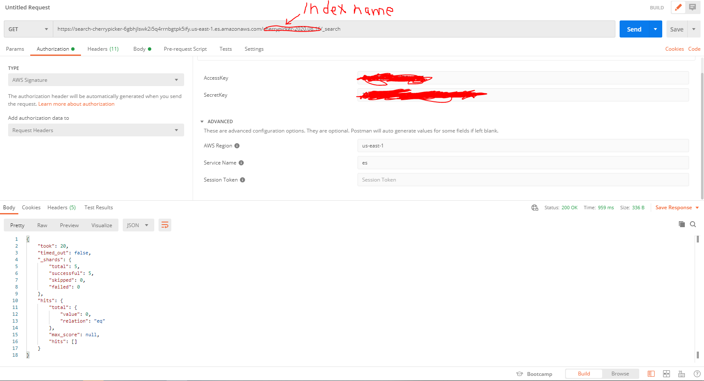

# CherryPicker-Elasticsearch-Logstash

- This project contains the configuration file to sync data from MongoDB Atlas to Elasticsearch cluster hosted on AWS.

- Instructions on running:

  1. Please obtain the .env file
  2. If using on a new EC2, Transfer your project folder to ec2 using FileZilla

     Add your .pem file to fileZilla

     setting>connection>SFTP

     file>SiteManager>(key in your ec2 endpoint)

  3. If using on a new EC2, export the following environment variables

     `export ELASTIC_SEARCH_ENDPOINT=<endpoint>`

     `export ELASTIC_AWS_ACCESS_KEY=<accesskey>`

     `export ELASTIC_AWS_SECRET_KEY=<secretkey>`

     `export MONGODB_CONNECTION_STRING=<mongo connection string>`

  4. SSH into EC2

     - Change Directory `cd path/to/pemfile`

       `ssh -i "cherryPicker.pem" ec2-user@ec2-54-172-188-74.compute-1.amazonaws.com`

  5. On EC2 execute the following commands

     - Change Directory `cd ~`

     - Run config file `../../usr/share/logstash/bin/logstash -f ~/CherryPicker-Elasticsearch-Logstash/logstash.conf`

- Details on EC2 setup

  https://medium.com/@ooiyueying/setup-ec2-for-connecting-mongo-atlas-to-aws-elasticsearch-with-logstash-b28babce5c12

- Verify Elasticsearch on AWS can receive query by using postman application to send query in the following manner.
  
